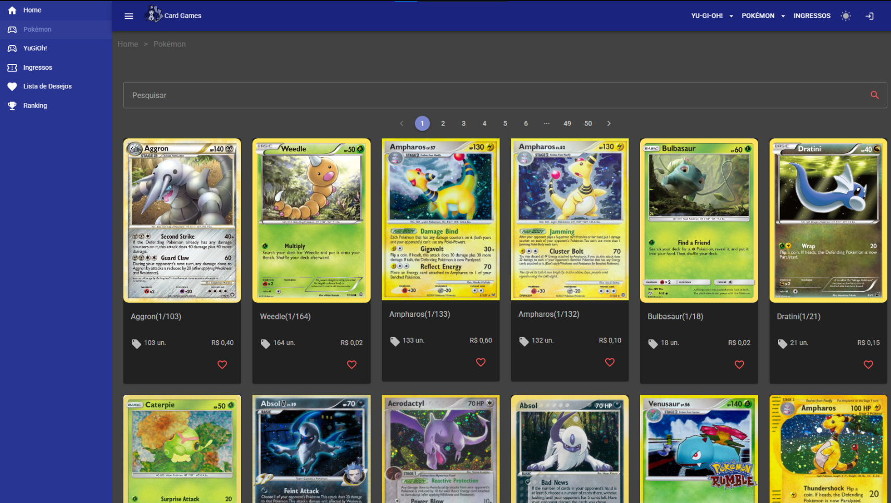
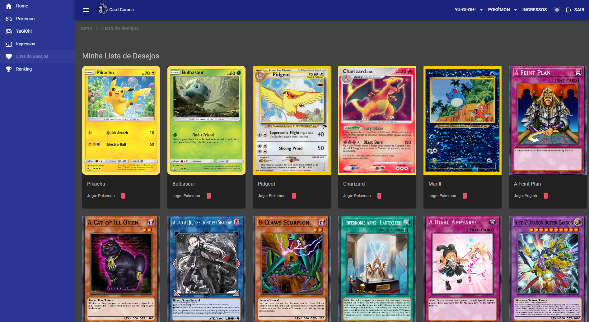

# Card Games 🃏

## Sobre o projeto

O Card Games é uma plataforma online desenvolvida para fins acadêmicos, voltada para clientes de lojas e jogadores que buscam informações detalhadas sobre eventos, cartas específicas e podem criar listas com seus cards favoritos. 
Atualmente, suporta Pokémon TCG e Yu-Gi-Oh! TCG. Desenvolvido com **Blazor WebAssembly (.NET 8)** e **MudBlazor**, oferece uma interface moderna, responsiva e fácil de usar.

A plataforma visa evoluir para permitir organização de coleções, comparação de cartas e mais recursos para entusiastas de card games, com o objetivo de atrair novos jogadores, fortalecer a comunidade e incentivar quem já faz parte desse universo.

## Demonstração 
### Tela de cartas Pokémon

### Tela lista de desejos

⚠️**Obs:** É necessário estar logado para acessar e gerenciar sua lista de desejos.

Para acessar a tela de login, clique no ícone localizado no canto superior direito da página. Use as credenciais abaixo para entrar:
- **Usuário:** `admin`  
- **Senha:** `123`  

## Acesse o projeto

Você pode acessar o projeto diretamente do seu navegador!

🌐 [Clique aqui para acessar o projeto online](https://isasamara.github.io/kedge-card-games/)

